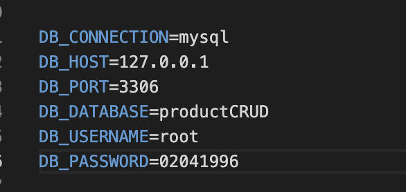
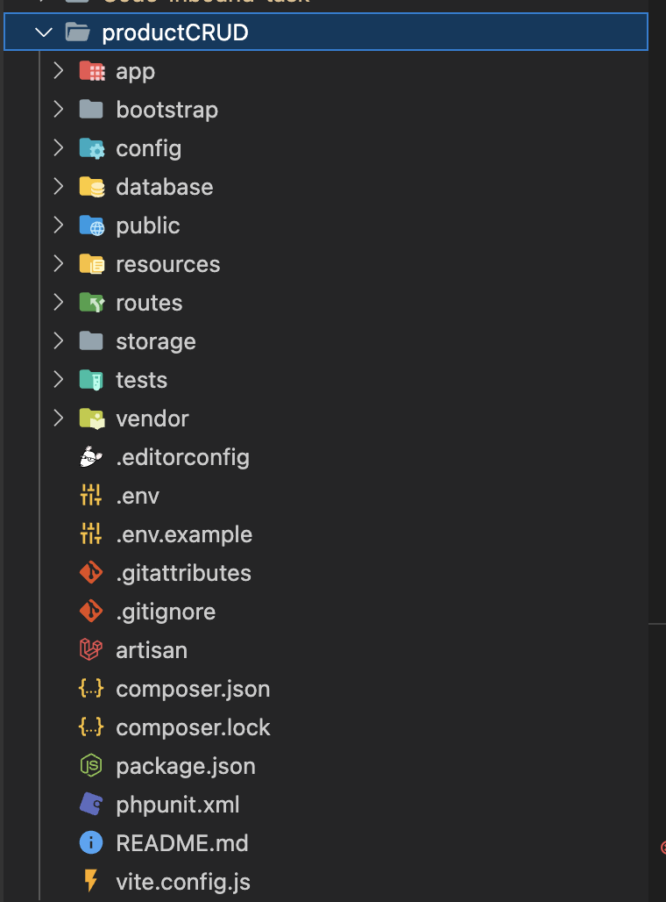
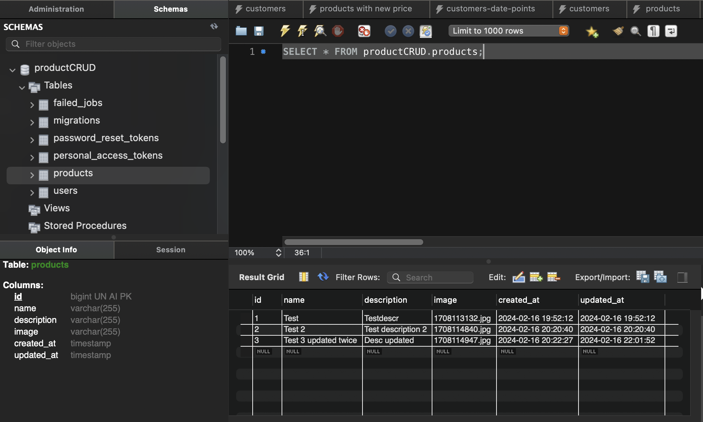

# productCRUD app

This is an app for an assignment of a job application at studentkhabri to show CRUD operations in an application. This project has following features:

1. Name of the product
2. Description of the product
3. Image of the product

Below are some of the learnings while creating this project.

### Clone the repo and run `php artisan serve` to run the project. You might see some test data initially on th homepage.

## Installing composer

Since php comes as default in MAC, we would need to install composer.
This can be done with the help of `brew` package manager on mac

```bash
brew install composer
```

## Installing Databases

-   For our application we are using `MySQL Community Edition`.
-   To download and start MySQL server you can visit: `https://dev.mysql.com/downloads/mysql/`
-   For GUI we are using `MySQL Workbench` which can also be downloaded from the above URL.
-   This Youtube tutorial might come in handy: `https://www.youtube.com/watch?v=7S_tz1z_5bA&t=4803s&ab_channel=ProgrammingwithMosh`

## Setting up MySQL Workbench

-   Create new connection
-   Head to Schemas and create a new DB called `productCRUD`
-   Host name would be: `127.0.0.1` Port: `3306`
-   Set up password for MySQL server by clicking `Store in Keychain`
-   Test the connection

## Setting up .env file for DB

-   Created a new DB called `productCRUD`
-   This is how the file's db section should look:
    
- Change the .env.example file -> .env and make the changes shown in the picture.
- This will connect you to the Database on my machine, if you really want to test it.

## Creating first laravel application

-   In VSCODE Go to the directory of your choice and type in `composer create-project laravel/laravel example-app` in the terminal

-   To run the application you can use `php artisan serve` command. This will start a local server on port `8000`.

The directory structure looks something like this:


# Understanding the code:

### views

In `resources -> views -> Welcome.blade.php` file is present by default. This will act as the home page of our app initially, but then is changed to `index.blade.php` later on

### Models and migration

-   To generate migration files (tables creation), use following command:
    `php artisan make:model Product -m`
-   This will generate a `Product.php` file in `app -> Models`.

-   Also it creates a folder named `migrations` inside `database -> migrations`, where all the tables related stuff resides.

-   This process creates a blueprint to be migrated to the Databases. The blueprint contains all the columns that need to be created in the table.

-   This is how a migration file should look:

```php
<?php

use Illuminate\Database\Migrations\Migration;
use Illuminate\Database\Schema\Blueprint;
use Illuminate\Support\Facades\Schema;

return new class extends Migration
{
    /**
     * Run the migrations.
     */
    public function up(): void
    {
        Schema::create('products', function (Blueprint $table) {
            $table->id();
            $table->string('name');
            $table->string('description');
            $table->string('image');
            $table->timestamps();
        });
    }

    /**
     * Reverse the migrations.
     */
    public function down(): void
    {
        Schema::dropIfExists('products');
    }
};
```

- a migration table is managed by laravel's `schema builder`, which you can use to create and modify tables.

### Controllers

-   We are using controllers to serve pages in this application.

-   use `php artisan make:controller productController` and see app\Http\Controllers\productController.php.

-   We will also need to change the default route in routes -> `web.php` under routes to:

```php
Route::get('/', [productController::class, 'index'])-> name('products.index');
```

- name is optional.

# APIs

### GET | `https://localhost:8000/ `-> `index()` -> [index.blade.php]  -> Returns a list of all products.

### POST | `https://localhost:8000/products/create `-> `create()` | [create.blade.php]  -> Takes user to the create page

### POST | `https://localhost:8000/products/store` -> `store()` | [create.blade.php] -> Validates and saves the data in the DB

### POST | `https://localhost:8000/products/{ id }/edit` -> `edit($id)` | [edit.blade.php] -> Takes the user to Edit page of the product

### PUT | `https://localhost:8000/products/{ id }/update` -> `update($request, $id)` | [edit.blade.php] -> Similar to create, updates the product information in DB

### DELETE | `https://localhost:8000/products/{ id }/delete` -> `destroy($id)` | [index.blade.php] -> Deletes the product


# Challenges

- Environmental set up was not easy in mac, had to follow a lot of tutorials.

- Since I come from a `JavaScript` backgrouind and I have built full stack application in NodeJS, ReactJS, MongoDB, it was somewhat difficult to adjust to the syntax. 

- Connecting to the DB was the most difficult bit as `phpmyadmin` is not mac-friendly so I had to use `MySQL Workbench`. Here's it how the data looks in the Workbench for the database:


